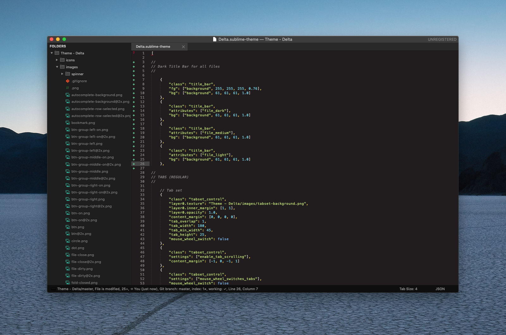

## Theme - Delta

A MacOS-like dark theme for Sublime Text, based on [Soda Theme] by Ian Hill.



Theme also includes retina (@2x) assets for use where applicable.

### Installation
This theme can be selected by cloning this package from GitHub:
```
git clone https://github.com/TimmyDax/Sublime-Theme-Delta
```

To activate the theme, add or modify the theme key in your Sublime Text User Preferences to the following:
```json
"theme": "Delta.sublime-theme"
```

### Attribution

Any use or forks allowed, but attribution is politely requested.


[Soda Theme]: http://buymeasoda.com/
